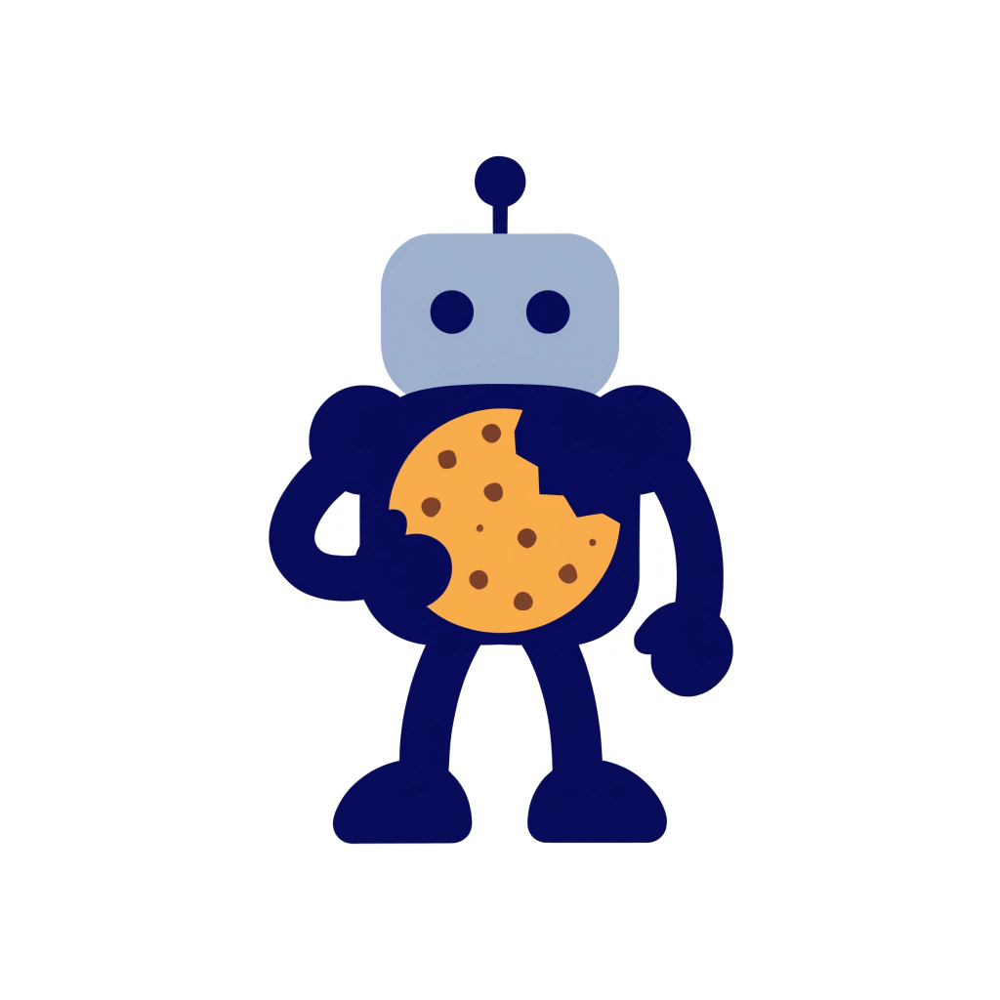

# Take AI Bite

**A framework for human-AI collaboration where the human stays in control, grows through the work, and retains every lesson learned.**

  

---

AI tools generate faster than humans can review. When the output exceeds what a person can meaningfully engage with, the collaboration quietly breaks: the human stops reading and starts clicking "approve." The human in the loop becomes decorative, and the distinctive value they bring, direction, judgment, style, goes missing from the work.

Take AI Bite is a set of principles for keeping the human genuinely present in AI-assisted work. Not by slowing the AI down, but by structuring collaboration so that every delivery is sized for real engagement.

But it goes further than review sizing. Take AI Bite builds an agent ecosystem that retains your memory, experience, and decisions across sessions and projects. The ecosystem becomes your avatar: an extension of your professional self that grows with you, remembers what you learned, and carries your accumulated expertise into every new collaboration.

## The Principles

Nine principles govern how humans and AI agents work together. Each addresses a specific failure mode in human-AI collaboration.

| Principle | Core idea |
|-----------|-----------|
| **Take a Bite** | Deliver only what the reviewer can chew. If they can't redirect it, it was too much. |
| **The Human Brings the Spark** | AI amplifies. The human provides direction, intuition, and aesthetic judgment. |
| **Earn Your Assertions** | Investigate before you claim. Verify before you act. Neither side gets to assume. |
| **Critical Thinking** | Understand first, review second, decide third. Then challenge your own reasoning: what did I miss? What am I assuming? |
| **Know Your Context** | The agent manages its own resource consumption. Don't charge ahead until overflow. |
| **Match the Room** | Contribute proportionally to the project's culture and scale. |
| **Own Your Process** | Disclose how the work was produced. Transparency about method is a professional obligation. |
| **Know What You Own** | Verify licensing before deployment. Free tier does not mean free use. |
| **Think Ahead** | Build the map before you walk the territory. Strategy emerges from operational maturity. |

For the full framework, see [`DSM_6.0_AI_Collaboration_Principles_v1.0.md`](DSM_6.0_AI_Collaboration_Principles_v1.0.md).

## The Engine: Deliberate Systematic Methodology (DSM)

These principles are operationalized by DSM, a living, versioned methodology that governs the full lifecycle of human-AI collaboration: research, implementation, governance, and disclosure.

DSM is not a static document. It evolves through a hub-spoke feedback loop where every session, every project, and every practitioner's experience feeds back into the methodology. Protocols are tested, refined, and propagated across the ecosystem. What one project discovers improves every future project.

This is what makes the avatar possible. Session transcripts capture reasoning. Checkpoints preserve milestones. Memory files retain context across sessions. Feedback flows from individual projects to the central methodology and back. The result is an ecosystem that accumulates your expertise, not just your files.

## Systems Prompt Engineering

Most prompt engineering focuses on crafting individual prompts. Take AI Bite operates at a different level: designing, versioning, and governing entire instruction systems across an ecosystem of projects.

This is Systems Prompt Engineering, a discipline that applies project management rigor to AI instruction artifacts. DSM's instruction ecosystem covers 7 of 10 PMP knowledge areas (scope, schedule, cost, quality, communication, risk, and integration management) through version-controlled protocols, automated feedback loops, and cross-project propagation.

The framework operates at three levels:

| Level | What it manages | Example |
|-------|----------------|---------|
| **Individual** | A single prompt or instruction | A system prompt, a chat message |
| **System** | Coordinated instructions for one project | CLAUDE.md + command files + session protocols |
| **Ecosystem** | Instruction architecture across projects | Hub-spoke propagation, feedback loops, mirror sync |

For the full chapter, see [`DSM_6.1_Systems_Prompt_Engineering_v1.0.md`](DSM_6.1_Systems_Prompt_Engineering_v1.0.md).

## Start Here

Two entry points serve different purposes.

Read [`DSM_0.0_START_HERE_Complete_Guide.md`](DSM_0.0_START_HERE_Complete_Guide.md) for the working introduction: what DSM is, how the ecosystem is organized, what each project type looks like, and how to start a session. This is the operational guide for practitioners.

Read [`TAKE_A_BITE.md`](TAKE_A_BITE.md) for the founding principle in two minutes: the cookie analogy that gives the project its name. This is the philosophical core that the operational guide implements.

## Current Status

Take AI Bite is at the WIP stage. The methodology has been developed and used internally across data science, software engineering, open source contribution, methodology documentation, research synthesis, and administrative work. It is published here as a public mirror.

The API surface (command files, protocols, templates) may shift before v2.0; pin to a tagged version if you need stability. If you want to engage with the design as it evolves, not only consume the output, this is the right stage to show up.

## Known Limitations

- No automated test coverage of the methodology itself. Behavioral validation happens per session.
- Single-maintainer project. Development pace tracks one person's bandwidth.
- No external validation yet. The methodology has been exercised on the hub plus one practitioner's spoke ecosystem; no third-party adoption.
- API surface may shift before v2.0. Expect breaking changes between minor versions during this phase.
- Documentation is authoritative but not exhaustive. Some patterns surface as the methodology evolves and have not yet been written down.

## Recent Features

Latest additions to the framework (click to expand)

- **Systems Prompt Engineering (DSM_6.1)** — A full chapter naming the discipline: version-controlled instruction systems, failure mode taxonomy, practitioner maturity model, and PMP knowledge area mapping
- **Document modularization** — All methodology documents split into slim cores with on-demand modules, reducing context consumption while preserving full coverage
- **Dual licensing** — CC BY-SA 4.0 for methodology documentation, MIT for scripts and code
- **Domain-neutrality audits** — All numbered DSM files reviewed and trimmed of domain-specific language, making the framework applicable to any project type
- **Incomplete wrap-up recovery** — When a session ends unexpectedly, the next session detects the gap and reconstructs the missing summary from the archived transcript
- **Session configuration recommendation** — Each session receives a tailored model and effort configuration based on planned work scope
- **Mirror repo sync** — Methodology files are automatically copied to public distribution repos after changes
- **Branch testing requirement** — Feature branches must be tested before merging, with specific test plans per backlog item
- **Ecosystem Path Registry** — Cross-repo paths declared in a local registry, eliminating hardcoded filesystem paths
- **Parallel session protocol** — Run isolated evaluation tasks on independent branches without interfering with the main session

See the full timeline of 84+ features → [FEATURES.md](FEATURES.md)

## Direction

Direction, not commitment. Items below describe where attention is going, not what will ship by a specific date.

**Near-term (active work):**

- **Structural compliance retrofit** — Applying document structure standards (TOC, intro paragraphs, line budgets) across all methodology files.
- **Onboarding guide** — Building a newcomer-friendly path into the framework for practitioners encountering DSM for the first time.

**Longer-term (exploratory):**

- **Queryable knowledge graph** — Exploring how to compile the human-authored methodology into a navigable, interconnected structure so the ecosystem's accumulated knowledge becomes searchable across projects and sessions. Design questions still open.

## Contributing

The project is at a stage where design input is more useful than feature requests. Useful contributions include:

- Design critique on protocols, principles, and command files; counterexamples from your own practice are especially valuable.
- Pattern suggestions drawn from how you already structure human-AI collaboration; what does your workflow do that DSM does not name yet?
- Bug reports against command files or scaffolding; concrete reproduction steps make these easy to act on.
- Usability feedback from trying to apply DSM to a new project; the friction you hit is the signal.

Read [CONTRIBUTING.md](CONTRIBUTING.md) for the contribution process.

## Links

- **Website:** [take-ai-bite.com](https://take-ai-bite.com)
- **Author:** [Alberto Diaz Durana](https://www.linkedin.com/in/albertodiazdurana/)

## License

This project uses dual licensing:

- **Methodology documentation** (DSM_0 through DSM_6, guides, TAKE_A_BITE.md): [CC BY-SA 4.0](LICENSE-DOCS.md)
- **Software components** (scripts/, configuration files): [MIT](LICENSE)
